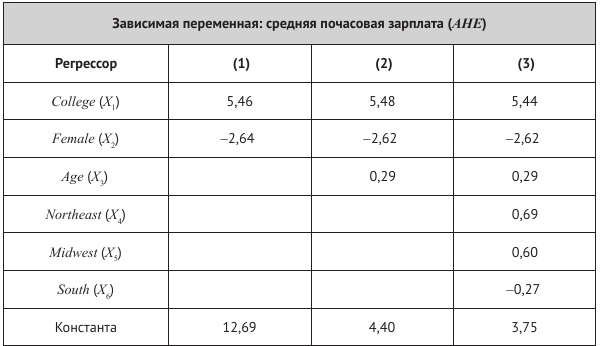

```{r setup, include=FALSE}
knitr::opts_chunk$set(echo = TRUE)
```


# Часть 1. Упражнения и вопросы

## SW, глава 6, упражнения 6.2-6.4
Первые упражнения относятся к таблице оценок регрессии на стр. 211, рассчитанных с использованием данных за 1998 год из текущего обследования населения (CPS). Набор данных состоит из информации по 4000 работникам занятым полный рабочий день в течение всего года. В рассматриваемой выборке присутствуют респонденты, имеющие либо аттестат средней школы, либо степень бакалавра. Возраст работника колеблется от 25 до 34 лет. В данных также содержится информация о регионе проживания респондентов, их семейном положении и количестве детей. Для целей этого упражнения обозначим:

* AHE = средняя почасовая заработная плата (в долларах 1998 года).

* College = бинарная переменная (1 --- если респондент закончил колледж, 0 --- если среднюю школу).

* Female = бинарная переменная (1 --- если респондент является женщиной, 0 --- если мужчиной).

* Age = возраст (в годах).

* Northeast = бинарная переменная (1 --- если респондент проживает на Северо-Востоке, 0 --- в противном случае).

* Midwest = бинарная переменная (1 --- если респондент проживает на Среднем Западе, 0 --- в противном случае).

* South = бинарная переменная (1 --- если респондент проживает на Юге, 0 --- в противном случае).

* West = бинарная переменная (1 --- если регион респондент проживает на Западе, 0 --- в противном  случае).



Задания: 

1. Проинтерпретируйте оцененные коэффициенты в стодбце (1). 

2. Проинтерпретируйте оцененные коэффициенты в стодбце (2). Обсудите, является ли возраст фактором, серьезно влияющим на доходы?

3. Проинтерпретируйте оцененные коэффициенты в стодбце (3). Имеют ли место региональные различия?  Почему регрессор West исключен из регрессии? Что бы произошло, если бы он был включен?


## SW, глава 6, вопрос 6.3
Объясните, почему две совершенно мультиколлинеарные объясняющие переменные не могут быть включены в модель линейной множественной регрессии. Приведите два примера пары совершенно мультиколлинеарных регрессоров.

## SW, глава 6, вопрос 6.4
Объясните, почему трудно точно оценить частный эффект влияния $X_1$ на зависимую пееременную, считая регрессор $X_2$ постоянным, если $X_1$ и $X_2$ тесно взаимосвязаны.


# Часть 2. Эмпирический пример

Ваша задача --- исследовать взаимосвязь между медицинскими расходами и наличием страховки у человека. 

## Исследовательский вопрос

1. Сформулируйте исследовательский вопрос.

2. Сформулируйте исследовательскую гипотезу.

3. Обсудите экономический механизм, который бы ее объяснял.  


## Модель

1. Выпишите модели парной линейной регрессии, который подходят для описания изучаемых взаимосвязей. 

2. Обсудите проблему пропущенных переменных. К каким последствиям она может привести?

3. Обсудите, какие контрольные переменные необходимо включить в модель для решения проблемы пропущенных переменных.


## Загрузка пакетов

Не забудьте загрузить необходимые пакеты.


## Набор данных

На этом семинаре мы работаем с внешним набором данных [MEPS.csv](datasets/MEPS.csv). Загрузите и изучите данные. Обсудите, какие переменные лучше всего подходят для ответа на поставленный исследовательский вопрос.

<details>
  <summary>Описание переменных</summary>
| Variable | Description                                               |
|----------|-----------------------------------------------------------|
| dupersid | Subject ID                                                |
| year03   | 1 if data is from meps 2003                               |
| age      | Age                                                       |
| famsze   | Size of the family                                        |
| educyr   | Years of education                                        |
| totexp   | Total medical expenditure                                 |
| private  | 1 if private supplementary insurance                      |
| retire   | 1 if retired                                              |
| female   | 1 if female                                               |
| white    | 1 if white                                                |
| hisp     | 1 if hispanic                                             |
| marry    | 1 if married                                              |
| northe   | 1 if northeast area                                       |
| mwest    | 1 if midwest area                                         |
| south    | 1 if south area (west is excluded)                        |
| regother | 1 if other area                                           |
| region   | area (northeast, midwest, south, or other)                |
| phylim   | 1 if has functional limitation                            |
| actlim   | 1 if has activity limitation                              |
| msa      | 1 if metropolitan statistical area                        |
| income   | annual household income/1000                              |
| injury   | 1 if condition is caused by an accident/injury            |
| priolist | 1 if has medical conditions that are on the priority list |
| totchr   | # of chronic problems                                     |
| omc      | 1 if other managed care (privately insured sample)        |
| hmo      | 1 if private insurance is hmo (privately insured sample)  |
| posexp   | 1 if total expenditure > 0                                |
| suppins  | 1 if has supp priv insurance                              |
| hvgg     | 1 if health status is excellent, good or very good        |
| hfp      | 1 if health status is fair or poor                        |
| ltotexp  | ln(totexp) if totexp > 0                                  |
| hins     | Excellent health indicator                                |
| hdem     | Demographic group indicator                               |
</details>


## Разведывательный анализ данных

Проведите разведывательный анализ данных: 

1. Постройте таблицу с описательными статистиками основных переменных.

2. Постройте графики, визуализирующие изучаемую взаимосвязь.

3. Можете провести дополнительный разведывательный анализ на свое усмотрение.


## Регрессионный анализ

Проведите регрессионный анализ: 

1. Оцените базовую модель парной регрессии. 

2. Оцените несколько моделей множественной регрессии, последовательно добавляя в модель различные контрольные переменные. Отдельное внимание уделите категориальныи переменным.

3. Сведите результаты оценки всех регрессий в одну таблицу. 

4. Проинтерпретируйте полученные результаты.

5. Оформите скрипт R так, чтобы он был понятным и воспроизводимым. 


## Бонусы

1. Проверьте гипотезу о равенстве нулю коэффициента при переменной страховки против разумной односторонней альтернативы. 

2. Оцените модель множественной регрессии, используя матричные операции в R. Рассчитайте стандартные ошибки оценок коэффициентов. 
