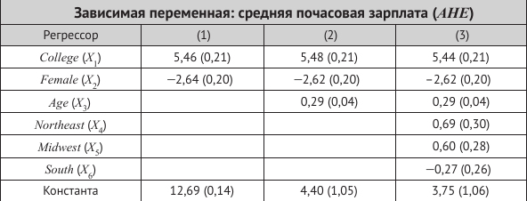

```{r setup, include=FALSE}
knitr::opts_chunk$set(echo = TRUE)
```

# Часть 1. Упражнения и вопросы

## SW, глава 7, вопрос 7.1
Объясните, как вы будете проверять нулевую гипотезу о том, что $\beta_1 = 0$ в модели множественной линейной регрессии $Y_i = \beta_0 + \beta_1 X_{1i} + \beta_2 X_{2i} + u_i$. 
Объясните, как вы будете проверять нулевую гипотезу о том, что $\beta_2 = 0$.
Объясните, как вы будете проверять совместную нулевую гипотезу о том, что $\beta_1 = 0$ и $\beta_2 = 0$. Объясните, почему результат совместной гипотезы не следует из результатов проверки первых двух гипотез.

## SW, глава 7, упражнения 7.1--7.4
Первые упражнения относятся к таблице оценок регрессии на стр. 249, рассчитанных с использованием данных за 1998 год из текущего обследования населения (CPS). Набор данных состоит из информации по 4000 работникам занятым полный рабочий день в течение всего года. В рассматриваемой выборке присутствуют респонденты, имеющие либо аттестат средней школы, либо степень бакалавра. Возраст работника колеблется от 25 до 34 лет. В данных также содержится информация о регионе проживания респондентов, их семейном положении и количестве детей. Для целей этого упражнения обозначим:

* AHE = средняя почасовая заработная плата (в долларах 1998 года).

* College = бинарная переменная (1 --- если респондент закончил колледж, 0 --- если среднюю школу).

* Female = бинарная переменная (1 --- если респондент является женщиной, 0 --- если мужчиной).

* Age = возраст (в годах).

* Northeast = бинарная переменная (1 --- если респондент проживает на Северо-Востоке, 0 --- в противном случае).

* Midwest = бинарная переменная (1 --- если респондент проживает на Среднем Западе, 0 --- в противном случае).

* South = бинарная переменная (1 --- если респондент проживает на Юге, 0 --- в противном случае).

* West = бинарная переменная (1 --- если регион респондент проживает на Западе, 0 --- в противном  случае).



Задания: 

1. Обозначьте в таблице уровень статистической значимости коэффициентов с помощью символов "\*" (5 %) и "\*\*" (1 %).

2. Для результатов регрессии из колонки (1): 

* Обсудите, является ли статистически значимыми на 5 %-м уровне значимости различия в доходах работников с дипломом бакалавра и школьным дипломом? 

* Сформулируйте гипотезы в содержательной, модельной и нормальной формах, предполагая разумную одностороннюю альтернативу. Обсудите применение критерия. Сделайте выводы. 

3. Для результатов регрессии из колонки (2): 

* Обсудите, является ли возраст важным фактором, определяющим доход? 

*  Пусть Салли -- 29-летняя женщина с дипломом бакалавра, а Бетси -- 34-летняя женщина с дипломом бакалавра. Сформулируйте гипотезы в содержательной, модельной и нормальной формах в отношении ожидаемых различий в их доходах. Обсудите применение критерия. Сделайте выводы. 

4. Для результатов регрессии из колонки (3):

* Обсудите, видите ли вы важные региональные различия в доходах? 

* Опишите процедуру проверки соответствующей гипотезы.

* Что делать, если хотя бы одна из региональных бинарных переменных или все сразу окажутся незначимыми?


# Часть 2. Эмпирический пример

На этом семинаре мы продолжаем разбирать пример, в котором мы изучали взаимосвязь между медицинскими расходами и наличием страховки у человека. 

Вспомните и обсудите, какие контрольные переменные мы включали в модель. 


## Модель

На этом семинаре мы рассмотрим один из вариантов модели: 

\[
totexp_i = \beta_0 + \beta_1 suppins_i + \beta_2 phylim_i + \beta_3 actlim_i + \beta_4 totchr_i + \beta_5 age_i + \beta_6 female_i + \beta_7 income_i + u_i, \dots
\]

## Гипотезы

Перед вами стоит задача --- проверить следующие гипотезы: 

A. Число хронических заболеваний оказывает значимое влияние на медицинские расходы. 

B. Дополнительное хроническое заболевание увеличивает медицинские расходы на 2000 долл. в год. 

С. Наличие функциональных ограничений оказывает такое же влияние на медицинские расходы, как и ограничение активности (having a functional limitation has the same impact on medical expenditures as having activity limitation). 

D. Статус здоровья влияет на медицинские расходы.

E. Разница в медицинских расходах людей с функциональными ограничениями и прочих в два раз больше, чем разница в медицинских расходах людей с ограничениями активности и прочих.


## Задание 1 (в тетради / у доски)

Для каждой из рассматриваемых содержательных гипотез: 

* Представьте гипотезу в модельной и нормальной форме, если это возможно.

* Определите тип ограничений.

* Обсудите, какая форма статистики Вальда здесь подходит?

* Распишите формулу статистики Вальда, убедитесь, что размерности всех матриц соблюдаются.

* Выпишите в явном виде все необходимые матрицы, связанные с ограничениями. 


## Задание 2 (в R)

### Набор данных

На этом семинаре мы работаем с внешним набором данных [MEPS.csv](datasets/MEPS.csv). Загрузите эти данные.


### Оценка параметров

Оцените модель регрессии, представленную выше, используя функцию `lm()`. 

### Проверка гипотез в автоматическом режиме

Осуществите проверку гипотез, описанных в Задании 1. Во всех случая используйте формулу Уайта для оценки ковариационной матрицы оценок коэффициентов. 

Для проверки гипотез c линейными ограничениями мы рекомендуем использовать функцию `linearHypothesis()` из пакета `car`. Кроме этого, можно использовать функцию `waldtest()`.

Для проверки гипотез с нелинейными ограничениями можно использовать функцию `nlWaldtest()` из пакета `nlWaldTest`.