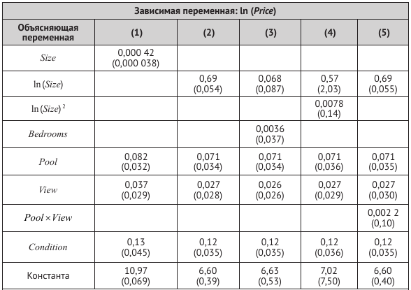
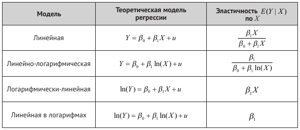

```{r setup, include=FALSE}
knitr::opts_chunk$set(echo = TRUE)
```

# Часть 1. Упражнения и вопросы

## SW, глава 8, вопрос 8.2
Производственная функция Кобба--Дугласа устанавливает связь между выпуском ($Q$) и факторами производства: капиталом ($K$), трудом ($L$) и сырьем ($M$) и компонентой ошибок $u$, используя соотношение $Q = \lambda K^{\beta_1} L^{\beta_2} M^{\beta_3} e^u$, где $\lambda$, $\beta_1$, $\beta_2$, $\beta_3$ являются параметрами производственной функции. Предположим, что у вас есть данные по выпуску и факторам производства из случайной выборки фирм с одинаковой производственной функцией Кобба—Дугласа. Как бы вы использовали регрессионный анализ для оценки параметров этой производственной функции?

## SW, глава 8, вопрос 8.5
Предположим, что в вопросе 8.2 вы думали, что значение $\beta_2$ не является постоянным, а возрастает при росте $K$. Как вы могли бы использовать компоненту взаимодействия, чтобы учесть этот эффект?

## SW, глава 8, вопрос 8.3
Стандартная функция "спроса на деньги", которая используется макроэкономистами, имеет форму $ln(m) = \beta_0 + \beta_1 ln(GDP) + \beta_2 R$, где $m$ --- (реаль­
ная) денежная масса, $GDP$ --- значение (реального) валового внутреннего продукта и $R$ --- значение номинальной процентной ставки, измеренной в процентах за год. Предположим, что $\beta_1 = 1.0$ и $\beta_2 = −0.02$. Что случится со значением $m$, если $GDP$ увеличится на 2 %? Что случится с $m$, если процентная ставка увеличится с 4 до 5 %?

## SW, глава 8, упражнение 8.2
Предположим, что исследователь собирает данные о домах, которые продаются в определенном районе за прошедший год, и получает оценки регрессий, представленные в таблице ниже.

Определения переменных: 

* Price = цена продажи (долл.); 

* Size = площадь дома (в квадратных футах);

* Bedrooms = число спален; 

* Pool = бинарная переменная (1 — если дом имеет бассейн, 0 — в противном случае);

* View = бинарная переменная (1 — если у дома прекрасный вид, 0 — в противном случае); 

* Condition = бинарная переменная (1 — если агент по недвижимости сообщает об отличном состоянии дома, 0 — в противном случае).



Задания: 

а) Используя результаты из столбца (1), определите ожидаемое изменение цены дома, если его площадь увеличится на 500 квадратных футов. Постройте 95 %-й доверительный интервал для процентного
изменения стоимости дома.

б) Сравнивая столбцы (1) и (2), скажите, какую переменную лучше использовать для объяснения стоимости домов: $Size$ или $\ln(Size)$?

в) Используя столбец (2), выясните, чему равен оцененный эффект влияния наличия бассейна в доме на его цену? (Убедитесь, что единицы измерения корректны.) Постройте 95 %-й доверительный интервал
для этого эффекта.

г) В регрессию из столбца (3) добавлена переменная, характеризующая число спален в доме. Насколько велик оцененный эффект от наличия дополнительной спальни? Является ли этот эффект статистически
значимым? Почему, как вы думаете, оцененный эффект так мал? (Подсказка: какие другие переменные остаются постоянными?)

д) Важна ли квадратичная компонента $ln(Size)^2$?

е) Используйте регрессию из столбца (5) для вычисления ожидаемого изменения в цене при наличии бассейна в доме без красивого вида. Является ли различие большим? Является ли различие статистически
значимым?

## SW, глава 8, упражнение 8.10+
Рассмотрим модель регрессии $Y_i = \beta_0 + \beta_1 X_{1i} + \beta_2 X_{2i} + \beta_3 ( X_{1i} \times X_{2i}) + u_i$. 

1. Проинтерпретируйте коэффициент $\beta_3$. Какую роль он выполняет в модели?

2. Покажите, что:

* $\Delta Y / \Delta X_1 = \beta_1 + \beta_3 X_2$ (эффект от  изменения $X_1$ при постоянной $X_2$).

* $\Delta Y / \Delta X_2 = \beta_2 + \beta_3 X_1$ (эффект от  изменения $X_2$ при постоянной $X_1$).

3. Опишите в деталях стратегию проверки значимости эффекта регрессора  ("в деталях" означает довести до выражений формул необходимых статистик, обсудить варианты интерпретации результатов тестов). Обсудите, в чем отличие этой проверки от проверки $H_0: \{\beta_1 = \beta_3 = 0\}$

## SW, глава 8, упражнение 8.11
Получите выражение для эластичностей, приведенных в приложении 8.2 (см. таблицу ниже), для линейной и линейной в логарифмах моделей. (Подсказка: для линейной в логарифмах модели предположите, что $u$ и $X$ независимы, как сделано в приложении 8.2 для логарифмически-линейной модели.)




# Часть 2. Эмпирический пример

На этом семинаре мы продолжаем разбирать пример, в котором мы изучали ценовую дискриминацию на рынке фастфуда по расе и доходу. 

Вспомните и обсудите, как вы исследовали эту проблему на одном из предыдущих семинаров.


## Данные
На этом семинаре мы продолжаем работать с набром данных ["discrim"](https://www.rdocumentation.org/packages/wooldridge/versions/1.4-2/topics/discrim), который можно загрузить из пакета [wooldridge](https://www.rdocumentation.org/packages/wooldridge/versions/1.4-2).

Как вы должны помнить, эти данные требуют определенной предварительной обработки, поэтому мы рекомендуем использовать в качестве скрипты, которые вы составляли на предыдущих семинарах. Также напоминаем, что для части задания был доступен [разбор кода](sem05_mult_reg_tutorial.html).


## Модель
На этом семинаре мы возьмем за основу такой вариант модели: 

\[
\begin{aligned}
psoda_i = \beta_0 + \beta_1 prpblck_i + \beta_2 income_i + \beta_3 prppov_i + \\
\beta_4 wagest_i + \beta_5 emp_i + \beta_6 crmrte_i + \beta_7 hseval_i + \\
\beta_8 compown_i + \beta_9 prpncar_i + \beta_{10} nstores_i + u_i, \dots
\end{aligned}
\]

Обсудите, является ли линейная форма регрессии достаточно адекватной для данной модели. Какие альтернативные функциональные формы можно предложить? Как можно обосновать выбор той или иной формы?


## Оценка параметров в моделях
1. При необходимости проведите предварительные преобразования и создайте новые переменные.

2. Оцените "линейную-линейную" модель. Обсудите результаты.

3. Оцените модель, введя в нее натуральные логарифмы для тех переменных, для которых такое преобразование разумно. Обсудите результаты.

4. Добавьте в модель произведение переменной `prpblck` с переменной `compown`. Обсудите смысл включения данной переменной в модель. Оцените модель, добавив в формулу выражение `I(prpblck * compown)` (альтернативой может быть выражение `prpblck:compown`).

5. Добавьте в модель квадрат переменной `prpblck`. Обсудите смысл включения данной переменной в модель. Оцените модель, добавив в формулу выражение `+ I(prpblck^2)`.

6. Для последней модели оцените предельный доли афроамериканцев в населении района на логарифм цены при различных уровнях этой переменной, зафиксировав значения остальных регрессоров на среднем уровне (для этого рекомендуется использовать функции `margins()` и `margins_summary()` из пакета `margins`). Рассчитайте доверительный интервал для этого предельного эффекта. Постройте график предельного эффекта с доверительным интервалом. Проинтерпретируйте полученные результаты. 