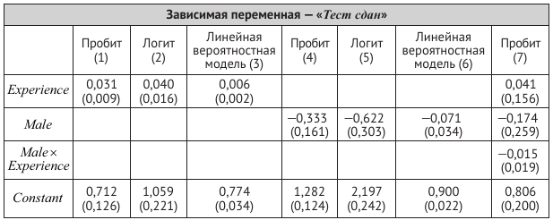

```{r setup, include=FALSE}
knitr::opts_chunk$set(echo = TRUE)
```

# Часть 1. Упражнения и вопросы

## SW, глава 11, упражнение 11.10 
(Необходимо изучить материал раздела 11.3 и использовать дифференциальное исчисление.)

Предположим, что случайная величина $Y$ имеет распределение $\Pr(Y = 1) = p$, $\Pr(Y = 2) = q$ и $\Pr(Y = 3) = 1 − p − q$. Случайная выборка размера $n$ формируется из генеральной совокупности с вышеуказанным распределением, случайные величины обозначаются как $Y_1, Y_2, \dots, Y_n$.

а. Запишите функцию правдоподобия для параметров $p$ и $q$.

б. Постройте формулы оценок максимального правдоподобия (ОМП) для параметров $p$ и $q$.


## SW, глава 11, упражнения 11.1--11.5
Упражнения 11.1–11.5 основываются на следующих предположениях. Случайным образом были опрошены четыреста претендентов на получение водительского удостоверения. Каждому из них был задан вопрос о том, сдали ли они свой экзамен на получение водительского удостоверения ($Pass_i = 1$) или провалили ($Pass_i = 0$). Также дополнительно были собраны данные о половой принадлежности респондентов ($Male_i = 1$, если респондент является мужчиной, и $Male_i = 0$, если респондент является женщиной) и их водительском опыте ($Experience_i$ --- водительский стаж в годах). В приведенной ниже таблице представлены результаты оценок нескольких моделей.



### 11.1
Используя результаты из столбца (1), ответьте на вопросы:

а) Зависит ли вероятность успешной сдачи теста от $Experience$? Поясните свой ответ.

б) Водительский стаж Мэтью составляет 10 лет. Какова вероятность того, что он успешно сдаст тест?

в) Кристофер --- начинающий водитель (не имеет опыта вождения). Какова вероятность того, что он сдаст тест?

г) Выборка содержала значения $Experience$ в интервале от 0 до 40 лет, но только четыре человека в выборке имели стаж вождения более 30 лет. Джеду 95 лет, он водит автомобиль с тех пор, как ему исполнилось 15 лет. Какова, согласно модели, вероятность того, что Джед успешно сдаст тест? Считаете ли Вы, что это значение является надежным? Поясните свой ответ.


### 11.2
Используя таблицу, представленную выше, ответьте на следующие вопросы:

а) Ответьте на пункты (а) — (в) упражнения 11.1, используя результаты, представленные в столбце (2);

б) Выпишите предсказанные вероятности на основе пробит- и логит-моделей из столбцов (1) и (2) для значений Experience в интервале от 0 до 60 лет. Похожи ли результаты, полученные на основе оценок пробит- и логит-моделей?


### 11.3. 
а) Ответьте на пункты (а) — (с) из упражнения 11.1, используя результаты столбца (3).

б) Выпишите предсказанные вероятности на основе пробит- и логит-моделей из столбцов (1) и (3) как функции от $Experience$ для значений $Experience$ в интервале от 0 до 60 лет. Как вы считаете, можно ли использовать в данном случае линейную вероятностную модель? Поясните свой ответ.

### 11.4
Используя результаты столбцов (4) — (6):

а) Вычислите оценки вероятностей успешной сдачи теста для мужчины и для женщины.

б) Различаются ли модели в столбцах (4) — (6)? Поясните свой ответ.


### 11.5
Используя результаты столбца (7):

а) Акира --- мужчина с 10-летним стажем вождения. Какова вероятность того, что он успешно сдаст тест?

б) Джейн --- женщина с двухлетним стажем вождения. Какова вероятность того, что она успешно сдаст тест?

в) Зависит ли влияние водительского стажа на прохождение теста от пола испытуемого? Проясните свой ответ.


# Часть 2. Эмпирический пример

## Вопрос и данные 
Файл [default.csv](datasets/default.csv) содержит финансовую и демографическую информацию о 850 бывших и потенциальных клиентах. Первые 700 наблюдений --- это клиенты, которые ранее получали кредиты. Последние 150 наблюдений представляют собой
потенциальных клиентов, которых банку нужно классифицировать как хорошие или плохие риски кредитования.


## Задание

1. Обсудите, какие переменные стоит включить в предсказательную модель.

2. Не забудьте провести разведывательный анализ!

3. Оцените logit-модель и probit-модель вероятности дефолта. Рассмотрите различные спецификации моделей.

4. Рассчитайте предельный эффект от изменения отношения объема задолженности к доходу респондента (DTI) на вероятность дефолта (используйте функции из пакета `margins`).

5. Проверьте гипотезу о совместной значимости переменных ADDRESS и EMPLOY (используйте функцию `linearHypothesis()` из пакета `car`).

6. Рассчитайте предсказанные вероятности для клиентов банка. Предскажите дефолты. Оцените предсказательную силу модели, используя показатели чувствительности и специфичности. Постройте ROC-кривую. Проинтерпретируйте результаты. 